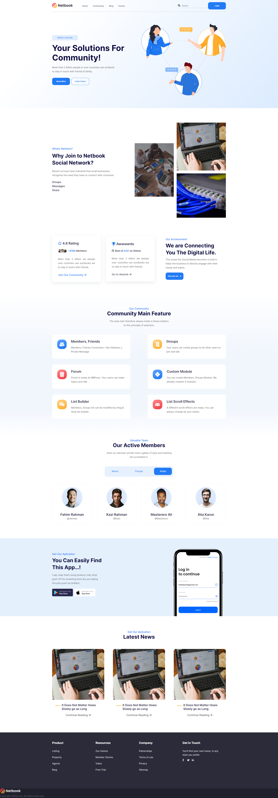

# Social engagement landing page (HTML & CSS)

A single-page marketing layout for a social or community product: hero, navigation with search, and anchored sections for community, events, and blog. Built with semantic HTML and custom CSS—no build step required.

**Live demo:** [GitHub Pages](https://shuvamallickpro.github.io/social-engagement-ui/)  
**Repository:** [github.com/ShuvaMallickPro/social-engagement-ui](https://github.com/ShuvaMallickPro/social-engagement-ui)

## Preview



## Tech stack

- HTML5
- CSS3
- [Google Fonts](https://fonts.google.com/) — Inter
- [Font Awesome 6](https://fontawesome.com/) (CDN)

## Features

- Responsive layout
- Sticky-style header with logo, nav links, search, and login CTA
- In-page sections: Home, Community, Events, Blog
- Modern UI suitable for customization or portfolio use

## Getting started

1. Clone or download this repository.
2. Open `index.html` in your browser, or serve the folder with any static file server.

## Project structure

```
├── index.html
├── css/
│   └── style.css
├── images/
└── README.md
```
